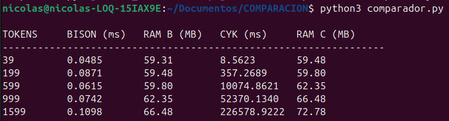
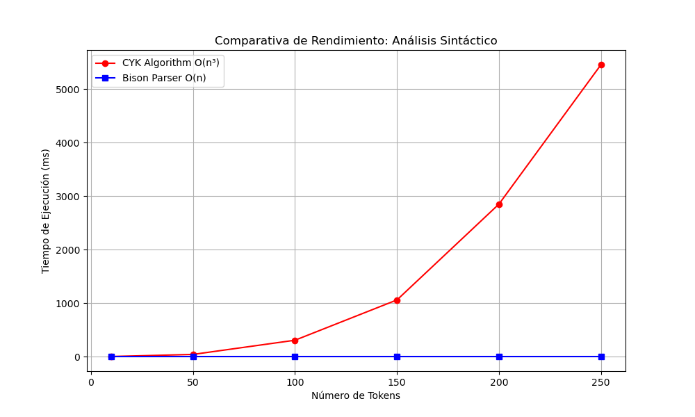
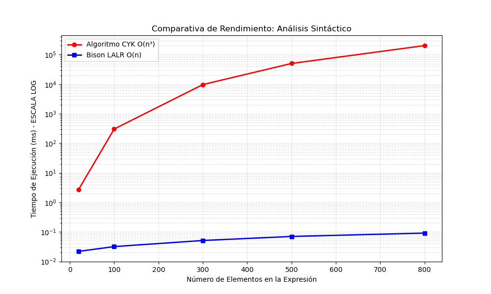

# COMPARACIO-CYK-ALGORITMOLINEAL


**INTRODUCCION**

Este proyecto compara el rendimiento real entre el Algoritmo CYK $$(O(n^3))$$ y el analizador Bison (LALR). A través de un programa automatizado en Python, se miden los tiempos de ejecución de ambos métodos al procesar expresiones cada vez más largas, demostrando cómo Bison mantiene una eficiencia lineal frente al crecimiento exponencial de CYK. Además, el sistema permite ingresar operaciones matemáticas mediante un archivo de texto para generar automáticamente sus árboles sintácticos usando la librería Lark y Graphviz.

**COMO EJECUTARLO**

PASO 1-Compilación del Parser (Bison)

Primero, debemos generar el ejecutable de C que el script de Python utilizará para las mediciones de tiempo:

```bash
flex lexer.l

bison -d parser.y
```
PASO 2-Compilar el ejecutable final
```bash
gcc lex.yy.c parser.tab.c -o bison_parser
```

PASO 3-Ejecución del programa Python

```bash
python3 comparador.py
```

**DESCRIPCION DE LOS CODIGOS**

1.Motor C (Flex & Bison)

Esta es la parte encargada de la velocidad bruta. Usamos Flex para despedazar la entrada en piezas pequeñas (tokens) y Bison para validar que esas piezas formen una operación matemática válida. Como está escrito en C y usa algoritmos de tabla, procesa miles de datos en una fracción de milisegundo. Es el estándar que usan los lenguajes de programación reales por su eficiencia lineal $O(n)$.

2.El comparador de rendimiento (comparador.py)

Este script es el cerebro de las pruebas. Aquí programamos a mano el Algoritmo CYK $$(O(n^3))$$ para ver cómo se comporta frente a Bison. El script lanza pruebas automáticas: crea operaciones cada vez más largas, se las pasa a Bison, luego las corre en CYK y mide cuánto tarda cada uno. Al final, te escupe una gráfica que muestra cómo CYK se rinde ante entradas grandes mientras Bison ni se despeina.

**RESULTADOS Y PRUEBA**

Pusimos a prueba ambos métodos con expresiones cada vez más largas para ver en qué punto el algoritmo CYK $$(O(n^3))$$ empezaba a sufrir. Los resultados en la terminal de Ubuntu son claros:



Al graficar esto, la diferencia es una locura. Mientras que Bison se mantiene como una línea recta (eficiencia lineal), la curva de CYK se dispara hacia arriba. Esto demuestra por qué en el mundo real usamos herramientas como Bison: procesar 1,500 elementos en 0.06 ms frente a esperar 3 minutos marca la diferencia entre un programa que funciona y uno que se queda congelado.

No todo es velocidad; el consumo de recursos también es crítico. Gracias al monitoreo con psutil, comprobamos que CYK requiere una cantidad de memoria significativamente mayor debido a la matriz de programación dinámica que debe construir en RAM. Mientras que Bison utiliza una pila optimizada con un consumo de memoria casi plano, CYK muestra un incremento cuadrático en el uso de megabytes, lo que podría llevar al agotamiento de recursos en dispositivos con hardware limitado.


**ANALISIS GRAFICAS**

Gráfica de Escala Lineal: El impacto real del tiempoEn esta primera gráfica podemos observar el comportamiento de los algoritmos tal cual lo experimenta el usuario. Es la representación visual de lo que llamamos la "curva del apocalipsis" para el método CYK. Mientras que la línea azul de Bison permanece completamente plana y pegada al eje horizontal, la línea roja de CYK se dispara hacia arriba en una curva agresiva. Esto deja claro que, a medida que la expresión crece, el esfuerzo del procesador no sube un poquito, sino que se multiplica exponencialmente. Es la prueba definitiva de que un algoritmo de complejidad $O(n^3)$ se vuelve inmanejable en cuanto pasamos de unos pocos cientos de elementos.



Gráfica de Escala Logarítmica: La segunda gráfica utiliza una escala logarítmica en el eje vertical para poder comparar ambos métodos de forma justa, ya que en la gráfica anterior la velocidad de Bison era tan alta que su línea prácticamente desaparecía. Al usar potencias de 10 en el eje del tiempo, finalmente podemos ver el trabajo de Bison como una línea recta constante muy por debajo de la competencia. Por su parte, la rampa ascendente de CYK demuestra que cada vez que añadimos tokens a la entrada, la brecha de rendimiento se vuelve miles de veces más grande. Esta visualización es fundamental para entender que, aunque ambos están procesando la misma información, la eficiencia estructural de Bison es órdenes de magnitud superior.




No todo es velocidad; el consumo de recursos también es crítico. Gracias al monitoreo con psutil, comprobamos que CYK requiere una cantidad de memoria significativamente mayor debido a la matriz de programación dinámica que debe construir en RAM. Mientras que Bison utiliza una pila optimizada con un consumo de memoria casi plano, CYK muestra un incremento cuadrático en el uso de megabytes, lo que podría llevar al agotamiento de recursos en dispositivos con hardware limitado.


**CONCLUCIONES**

La comparativa demuestra que la diferencia entre la eficiencia lineal y la cúbica es abismal en la práctica. Mientras que Bison procesó 1,500 elementos en apenas 0.06 ms, al algoritmo CYK le tomó más de 3 minutos completar la misma tarea. Esto confirma que para cualquier compilador moderno, el análisis lineal es la única opción viable, ya que esperar minutos por procesar unas cuantas líneas de código sería inaceptable en un entorno real.

Además, el uso de árboles sintácticos permitió validar que la velocidad de Bison no sacrifica la precisión, respetando correctamente la jerarquía y prioridad de los operadores. En conclusión, este trabajo resalta por qué herramientas industriales como Flex y Bison siguen siendo el estándar: su capacidad para manejar grandes volúmenes de datos con un impacto mínimo en el procesador las hace piezas fundamentales de la computación actual.
